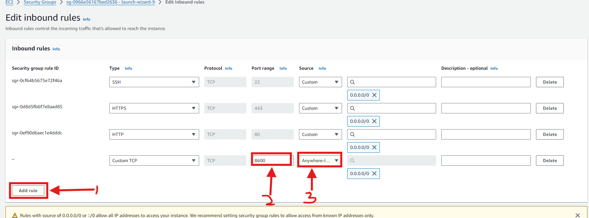
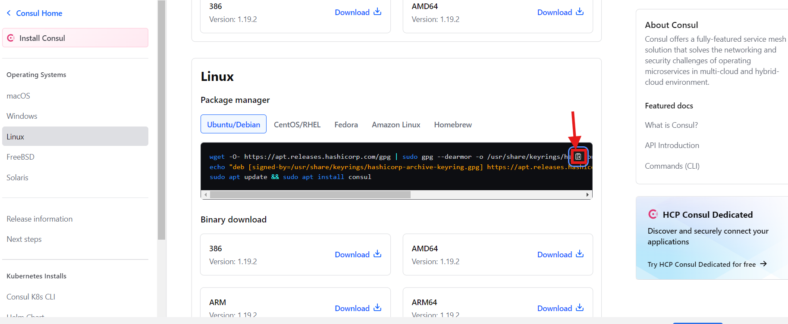
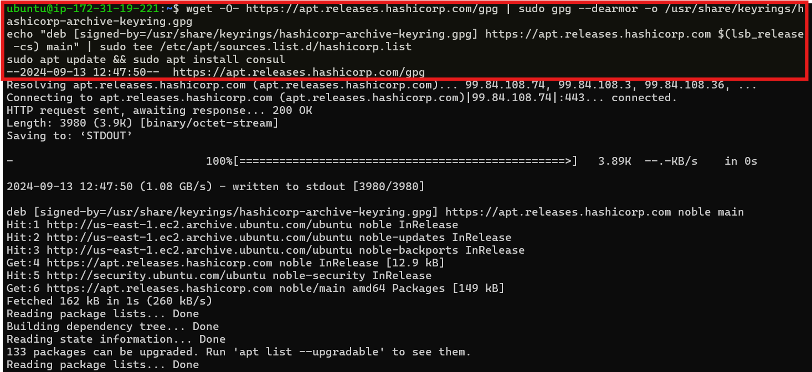
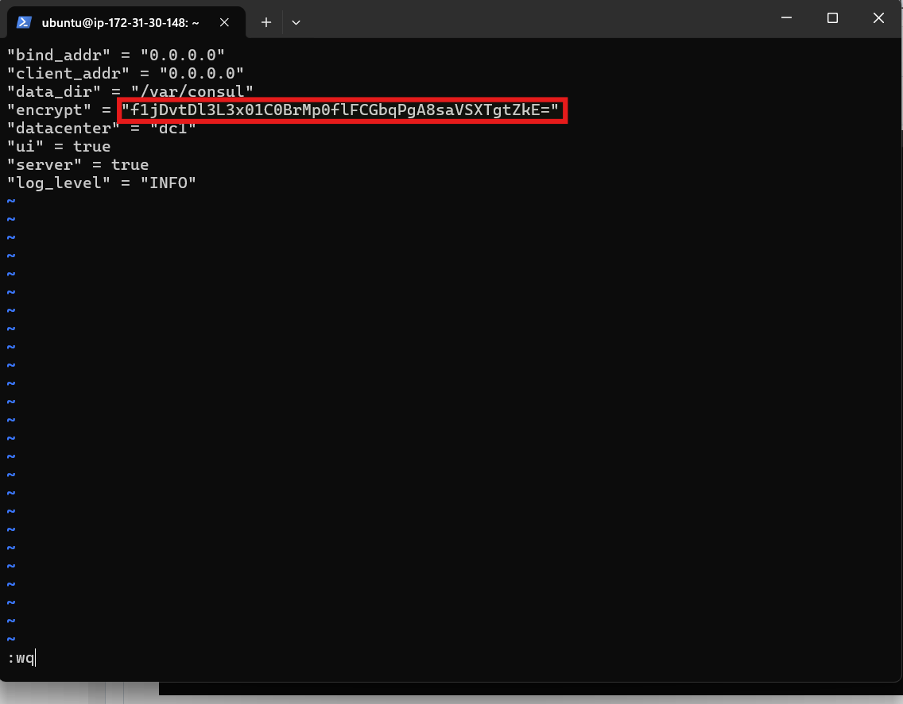
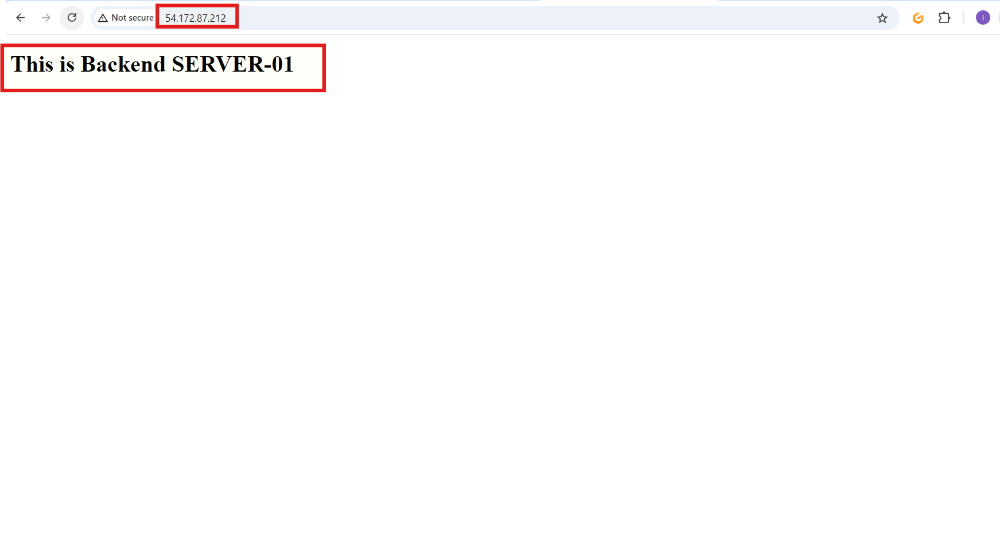

# Project5: Setting-up Service Discovery Using Nginx & Consul

## Introduction

### Service Discovery

In this project, I will set up Service discovery using Nginx and Consul. To statrt with, Service discovery essentially automates how services connect in a network, essential for microservices. It replaces the old method of manually setting up connections, making it easier to manage dynamic systems where services constantly change.

### Consul

Consul is an open-source tool that automates service discovery, health checks, and configuration management in distributed systems, making it ideal for managing cloud-based microservices.

Let's dive right into it...

Using the knowledge from previous projects especially project1, I was able to spin up 4 Ubuntu servers. Thess were successfully deployed.

* I renamed the EC2 instances so I do not confuse them with each other during the project. I renamed each with their names as shown below:

* To ensure Consul operates correctly, I opened the following ports in the security group and assign the same security group to all instances as shown in the following:

  1. Check the box next to the instance, click on security and click on security group ID

  2. Click on Edit inbound rules

  3. Click on Add rule

  4. Enter the Port range, Select the correct CIDR block and Click on "Add Rule" to define the port range for the UDP protocol as shown below:

  5. Click the Type field and choose Custom UDP from the dropdown menu.

  6. Specify the port range and select the CIDR blocks

  7. I repeated this process until all required ports have been opened

### Setting-up my Consul Server

* I SSH into my consul server and run **sudo apt update** to refresh the package cache

* I also visited https://developer.hashicorp.com/consul/install page and copied the installation command as shown below:

* I pasted the link copied above in my consul server as shown below:

* I used **consul --version** to confirm the consul installation version

* I use the command below to rename Consul server:

* I generate **encrypted key** using the command as shown below:

* I created a a new file using the command **sudo vi /etc/consul.d/consul.hcl**

* I added the content shown below and inserted the encrypted key generated earlier:

* I used the command shown below to start the Consul server in the background:

* I used the command below to check the status of my Consul server:

* I used my Consul server's public IP address to visit my Consul dashboard as shown below:

### Setting-up of Backend Servers

* I SSH into 2 banckend servers concurrently and run **sudo apt-get update -y** to refresh the package cache

* I installed nginx on both instances by running the command **sudo apt install nginx -y** as seen below:

* After installing nginx, I used the command **cd /var/www/html** to get to the HTML directory followed by **sudo vi index.html** to open the HTML file

* I then copied the HTML content as shown below into the index.html file. On the second server, I replaced SERVER-01 with SERVER-02 in the HTML file to differentiate between the two backend servers

* I installed Consul as an agent on the servers using the command as shown below:

* I run the command **consul --version** to Verify that Consul is installed properly

* I renamed the default file and created a new one by running the command **sudo mv /etc/consul.d/consul.hcl /etc/consul.d/consul.hcl.back
sudo vi /etc/consul.d/consul.hcl** replacing the encrypted key as well as the consul server appropriately as shown below:

* Using **sudo vi /etc/consul.d/backend.hcl** i added the following contents to the backend.hcl file and saved it

* I confirmed the configurations by running the command as shown below:

* I started the Consul agent with the command shown below:

* To confirm everything is functioning properly, I checked the Consul UI. If the backend appears in the UI as shown below, it means it has successfully registered with Consul:

### Setting-up of Load-Balancer

* I SSH into the Load Balancer server and run **ssudo apt-get update -y and 
sudo apt-get install unzip -y** to update the package information and install unzip with the following commands:

* I installed nginx using the command **sudo apt install nginx -y** as shown below:

* I downloaded the consul template binary(1) and checked the installation of the consul template's version(2) using the command shown below:

* I pasted the content shown below to create and edit a file named **load-balancer.conf.ctmpl** in the **/etc/nginx/conf.d** directory:

* I used the command **sudo vi /etc/nginx/conf.d/consul-template.hcl** to create and edit the file **consul-template.hcl** in the **/etc/nginx/conf.d/** directory. I then replaced consul server in the file with my consul server's IP address as shown below:

* I then deleted the default server configuration to disable it by running the command below:

* I restarted nginx to apply the changes by running the command **sudo systemctl restart nginx**. After completing the configurations, I used the following command to start the Consul Template agent which will continuously monitor Consul for any changes:

* Once completed, a load-balancer.conf file is generated, containing backend server details sourced from the Consul service registry as shown below:

* I access the load balancer's IP in the browser, it shows custom HTML from one backend server. Refreshing the page routes to the other server to displaying its content.

## Service Discovery Test

* Now that everything is set up, I test the configuration by stopping one of the backend servers. Consul will monitor the health of each service and, once a server is stopped, it will mark it as unhealthy and remove it from the load balancer. This ensures traffic is only routed to healthy servers, keeping the application running smoothly without disrupting users. This test shows how effectively Consul and Nginx manage service discovery and health checks. This is seen in the images below.

End of Project 5